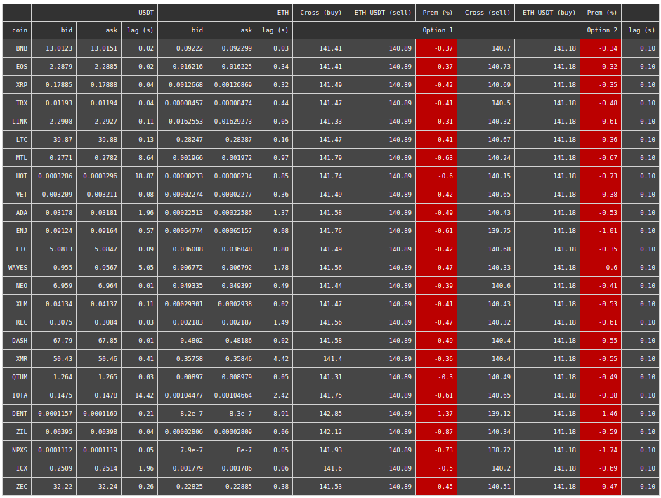

##### ABOUT  

The aim of the project is to study spot pricing discrepancies across currency pairs.  
- A redis database containing prices is updated real-time through a websocket connection to an exchange. With each update, arbitrage is recaculated to reflect the most recent price change.
- Python's Dash framework is then used to monitor the markets and discrepancies.

##### FUTURE DEVELOPMENTS  
Integrate an algorithm that monitors the markets, and hits of the best bid/ask taking the minimum volume across a triangle and sends subsequent trades on the remaining 2 pairs.  

##### WORKING SNAPSHOT  
